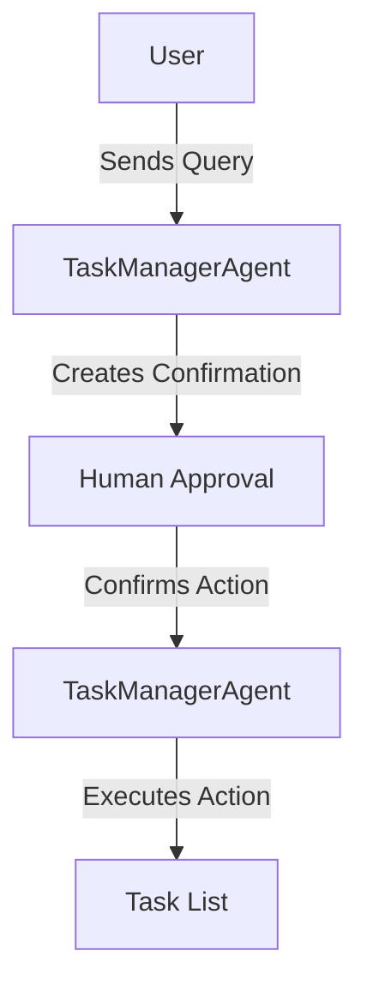
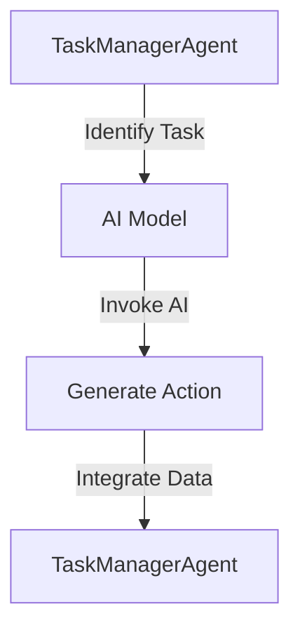
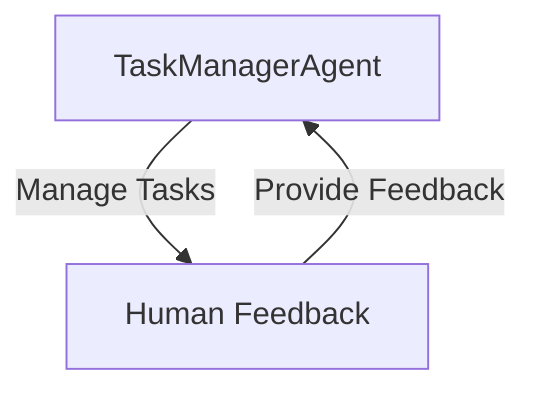

# Agent Task Manager Human In The Loop

This project is an intelligent task management system that leverages AI to manage tasks with human-in-the-loop confirmations. It allows users to add, delete, and list tasks, with actions requiring human approval before execution.

## Table of Contents
- [Overview](#overview)
- [Usage](#usage)
- [Architecture](#architecture)

## Overview
The Agent Task Manager Human In The Loop is designed to manage tasks intelligently using AI. It processes user queries to determine actions such as adding, deleting, or listing tasks. Actions are confirmed by humans before execution, ensuring control and accuracy. The system uses Durable Objects to maintain state and handle task confirmations.

## Usage
To start the project locally, use the following command:
```
npx nx dev agent-task-manager-human-in-the-loop
```

### NPM Scripts
- **deploy**: Deploys the application using Wrangler.
- **dev**: Starts the development server using Wrangler.
- **lint**: Lints the source code using Biome.
- **start**: Starts the development server using Wrangler.
- **test**: Runs tests using Vitest.
- **test:ci**: Runs tests in CI mode using Vitest.
- **type-check**: Checks TypeScript types without emitting files.

### API Endpoints
#### POST /query
- **Request**:
  ```jsonc
  {
    "agentId": "string",
    "prompt": "string"
  }
  ```
- **Response**:
  ```jsonc
  {
    "confirmation": {
      "id": "string",
      "action": "add" | "delete",
      "title": "string",
      "description": "string",
      "taskId": "string"
    },
    "message": "string"
  }
  ```
- **Curl Command**:
  ```bash
  curl -X POST http://localhost:8787/query -H "Content-Type: application/json" -d '{"agentId": "your-agent-id", "prompt": "your-prompt"}'
  ```

#### POST /confirmations/:confirmationId
- **Request**:
  ```jsonc
  {
    "agentId": "string",
    "confirm": true | false
  }
  ```
- **Response**:
  ```jsonc
  {
    "result": "Task | string | false | undefined"
  }
  ```
- **Curl Command**:
  ```bash
  curl -X POST http://localhost:8787/confirmations/{confirmationId} -H "Content-Type: application/json" -d '{"agentId": "your-agent-id", "confirm": true}'
  ```

## Architecture
The system is built as an application using Durable Objects to manage state. It employs a human-in-the-loop pattern to ensure that AI-generated actions are confirmed by a human before execution.

### System Diagram


### Agentic Patterns
#### Tool Use Pattern
The system uses the Tool Use Pattern by dynamically interacting with AI models to determine task actions and confirmations.



#### Autonomous Agent
The TaskManagerAgent acts as an autonomous agent, managing tasks dynamically and seeking human feedback for confirmations.



<!-- Last updated: 038947bb9b4fd6d8d05f28479e966cd36b43658e -->
